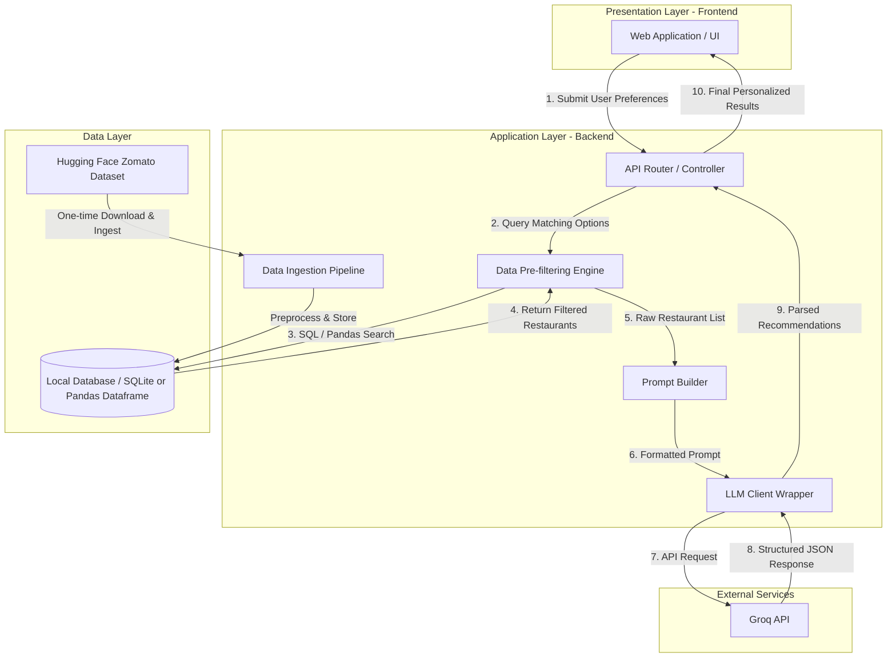
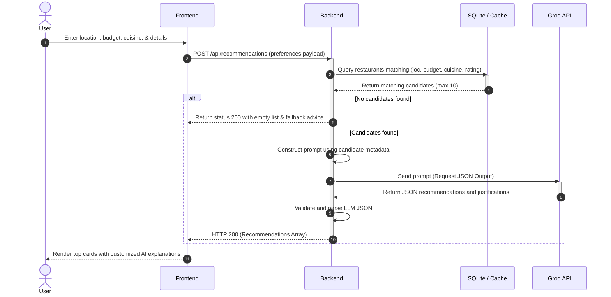

# System Architecture: AI-Powered Restaurant Recommendation System

This document outlines the detailed architecture, data pipelines, schema designs, API contracts, and engineering strategies for the AI-Powered Restaurant Recommendation System.

---

## 1. System Topology Overview

The application is structured as a classic **Three-Tier Architecture** consisting of a User Interface, a Backend Application Server, and a Data Storage/Query layer, integrated with an external Large Language Model (LLM) service.



---

## 2. Component Design & Roles

### 2.1. Presentation Layer (Frontend)
*   **Preferences Form**: Captures location (city/locality), cuisine types, budget tier, minimum star rating, and open-ended preference text (e.g., *"rooftop seating, quiet ambient music"*).
*   **Interactive Dashboard**: Renders recommendations in a cards or list layout. Highlighted metrics include rating badges, pricing symbols (e.g., `$$`), and the AI-generated personalization snippet.
*   **Loading State**: Uses skeleton screens while backend is executing DB filtering and LLM inferences.

### 2.2. Application Layer (Backend)
*   **Data Ingestion Pipeline**: Checks for local cached data. If absent, downloads the Zomato dataset from Hugging Face, cleans the columns, parses data types (costs, ratings), and saves it to a persistent local SQLite database or in-memory Pandas dataframe.
*   **Pre-Filtering Engine**: Optimizes LLM performance and token costs by running strict queries first. If a user asks for "Bangalore, Italian, Budget = Low", the engine filters the dataset down to matching candidates.
*   **Prompt Builder**: Merges user constraints with the filtered list. It generates a markdown or XML-structured list of candidate restaurants for the LLM to analyze, alongside system instructions that enforce constraint adherence and JSON output formats.
*   **LLM Client Wrapper**: Manages the API calls, configures safety settings, defines temperature parameters (e.g., `0.2` for structured, deterministic ranking and `0.7` for creative explanations), and parses responses.

### 2.3. Data Layer
*   **Hugging Face Dataset**: Remote dataset provider.
*   **Structured Database**: SQLite or localized CSV/Parquet storage. Contains tables for `restaurants`, `cuisines`, and `locations` to speed up queries.

---

## 3. Data Schema & Types

### 3.1. Database Schema (`restaurants` table)
| Field | Type | Description |
| :--- | :--- | :--- |
| `id` | INTEGER (PK) | Unique auto-incrementing ID. |
| `name` | VARCHAR(255) | Name of the restaurant. |
| `location` | VARCHAR(255) | City or locality. |
| `cuisines` | TEXT | Comma-separated list of cuisines (e.g., "Italian, Fast Food"). |
| `average_cost_for_two` | INTEGER | Numeric cost value. |
| `currency` | VARCHAR(10) | Currency symbol or code (e.g., "Rs."). |
| `has_table_booking` | BOOLEAN | Indicates if booking is available. |
| `has_online_delivery`| BOOLEAN | Indicates if delivery is available. |
| `rating_number` | FLOAT | Numeric aggregate rating (e.g., 4.2). |
| `rating_text` | VARCHAR(50) | Qualitative rating (e.g., "Very Good"). |
| `votes` | INTEGER | Number of reviews/votes. |

### 3.2. API Models (JSON Contracts)

#### User Preference Payload (`POST /api/recommendations`)
```json
{
  "location": "Bangalore",
  "budget": "medium",
  "cuisine": "Italian",
  "min_rating": 4.0,
  "additional_preferences": "Must have outdoor seating, family friendly, and good pasta dishes."
}
```

#### Final Response Payload
```json
{
  "user_context": {
    "location": "Bangalore",
    "cuisine": "Italian",
    "budget_limit_for_two": 1500
  },
  "recommendations": [
    {
      "rank": 1,
      "name": "Toscano",
      "cuisine": "Italian, Pizza",
      "rating": 4.4,
      "cost_for_two": 1200,
      "currency": "Rs.",
      "ai_explanation": "Toscano is the top choice because it fits your medium budget (average cost Rs. 1200 for two) and has excellent outdoor seating as requested. Users frequently praise their hand-tossed pasta dishes, making it perfect for a family dinner."
    }
  ]
}
```

---

## 4. Integration & Prompt Engineering Strategy

### 4.1. Pre-Filtering Strategy
To avoid token bloat and LLM confusion, the Backend Filters the dataset:
1.  **Strict Location Matching**: Filters by `location` (case-insensitive).
2.  **Cuisine Matching**: Checks if the user-specified cuisine is a substring of the restaurant's `cuisines` list.
3.  **Budget Tier Mapping**:
    *   `low`: `average_cost_for_two` < 500
    *   `medium`: `500 <= average_cost_for_two <= 1500`
    *   `high`: `average_cost_for_two` > 1500
4.  **Rating Threshold**: `rating_number` >= `min_rating`.
5.  **Sampling**: If matching results exceed 10 records, the engine selects the top 10 by `rating_number` and `votes` count to send to the LLM.

### 4.2. Prompt Structure Design
The Integration Layer compiles the following system and user prompt block:

#### System Prompt
> You are Zomato's AI Restaurant Recommendation Assistant. Your job is to select the best 3 restaurants from the provided list that match the user's specific preferences, rank them in order of match quality, and write a personalized explanation for why each was chosen.
> 
> You MUST return your output in JSON format adhering to the following structure:
> ```json
> {
>   "recommendations": [
>     {
>       "rank": 1,
>       "name": "Restaurant Name",
>       "cuisine": "Cuisine List",
>       "rating": 4.5,
>       "cost_for_two": 1000,
>       "currency": "Rs.",
>       "ai_explanation": "Personalized description highlighting why this place matches the specific user criteria."
>     }
>   ]
> }
> ```

#### User Prompt
> **User Context**:
> * Location: Bangalore
> * Budget Tier: Medium (Rs. 500 - 1500)
> * Cuisine: Italian
> * Rating: 4.0+
> * Additional Preferences: "Outdoor seating, good pasta, family friendly"
> 
> **Candidate Restaurants**:
> 1. Name: Toscano | Rating: 4.4 | Cost: 1200 | Cuisines: Italian, Pizza | Highlight: Outdoor patio seating.
> 2. Name: Chianti | Rating: 4.5 | Cost: 1800 | Cuisines: Italian | Highlight: Fine dining, indoor only.
> 3. Name: Little Italy | Rating: 4.1 | Cost: 900 | Cuisines: Italian, Vegetarian | Highlight: Family-friendly vegetarian buffet.
> 
> Suggest the top 3 (or fewer if candidate list is small) matching restaurants.

---

## 5. Sequence Diagram



---

## 6. Implementation & Technology Stack Recommendations

To build this system rapidly and robustly, the following stack is recommended:

*   **Frontend**:
    *   **Core**: HTML5, Vanilla JavaScript, CSS3 (using custom variables, transitions, and flexible box models for responsive layout).
    *   **Features**: Fetch API for backend requests, dynamic DOM rendering, CSS loader animations.
*   **Backend**:
    *   **Language**: Python 3.10+
    *   **Framework**: FastAPI (automatic OpenAPI docs, fast async request execution).
    *   **Data Handling**: Pandas (for initial Hugging Face dataset processing) and SQLite (for database queries).
*   **LLM Service**:
    *   **API**: Groq API (models like `llama-3.3-70b-versatile` or user-defined custom models).
    *   **SDK**: `groq` Python library.
