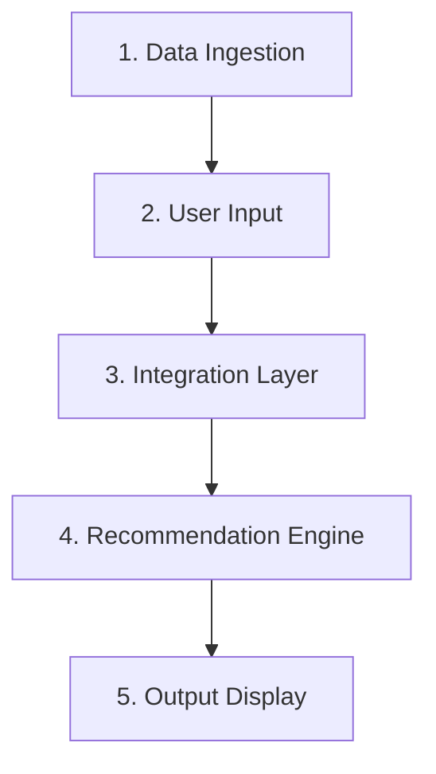

# AI-Powered Restaurant Recommendation System (Zomato Use Case)

This document provides context and specifications for building the AI-Powered Restaurant Recommendation System. It serves as the reference guide for understanding the system's goals, architecture, data requirements, and workflow.

---

## 1. Project Overview & Objective

The goal is to design and implement an intelligent restaurant recommendation service inspired by Zomato. The system combines structured restaurant data with the reasoning and personalization capabilities of a Large Language Model (LLM) to suggest restaurants based on user-specified preferences.

### Core Objectives
*   **Structured Filtering**: Dynamically filter a database of restaurants using criteria like location, budget, cuisine, and rating.
*   **LLM Personalization**: Leverage an LLM to generate natural, human-like, and highly personalized recommendations.
*   **Interactive UI/Output**: Display filtered and ranked options along with tailored justifications explaining why each restaurant fits the user's criteria.

---

## 2. System Workflow

The application operates through five distinct phases:

### Phase 1: Data Ingestion
*   **Dataset Source**: Hugging Face - [ManikaSaini/zomato-restaurant-recommendation](https://huggingface.co/datasets/ManikaSaini/zomato-restaurant-recommendation)
*   **Responsibilities**:
    *   Load and clean the dataset.
    *   Extract essential features: Restaurant Name, Location, Cuisine, Average Cost for Two, Aggregate Rating, etc.

### Phase 2: User Input Collection
Collect structured and unstructured inputs from the user:
*   **Location**: The target city or neighborhood (e.g., Delhi, Bangalore).
*   **Budget**: Classified into tiers (Low, Medium, High).
*   **Cuisine**: Type of food desired (e.g., Italian, Chinese, North Indian).
*   **Minimum Rating**: Numerical threshold (e.g., 4.0+).
*   **Additional Preferences**: Custom notes (e.g., "family-friendly", "romantic setting", "quick service", "rooftop seating").

### Phase 3: Integration Layer
*   **Pre-Filtering**: Perform initial database-level filtering using the structured inputs (Location, Budget, Cuisine, Rating) to narrow down the dataset to relevant candidates.
*   **Prompt Construction**: Construct a structured prompt containing:
    1.  The user's query and specific preferences.
    2.  The matching subset of restaurant data (name, ratings, cost, key highlights).
    3.  Instructions for the LLM to reason, rank, and explain.

### Phase 4: Recommendation Engine (LLM)
*   **LLM Role**:
    *   Analyze the filtered candidate restaurants against the user's explicit and implicit preferences.
    *   Rank the top recommendations.
    *   Generate a natural-language description for each, detailing why it is a suitable choice (e.g., *"Since you want a family-friendly place with Italian food in Bangalore, [Restaurant] is an excellent choice due to its spacious seating and highly-rated wood-fired pizzas."*).

### Phase 5: Output Display
Present the recommended options to the user with the following details:
1.  **Restaurant Name**
2.  **Cuisine**
3.  **Rating**
4.  **Estimated Cost (for two)**
5.  **AI-Generated Personalized Explanation**

---

## 3. Reference Links

*   **Dataset URL**: [ManikaSaini/zomato-restaurant-recommendation on Hugging Face](https://huggingface.co/datasets/ManikaSaini/zomato-restaurant-recommendation)
*   **Original Specifications**: [problemStatement.txt](file:///d:/Product%20Management%20job%20in%203%20months/Cursor/learn/ResturantRecommendation/docs/problemStatement.txt)
